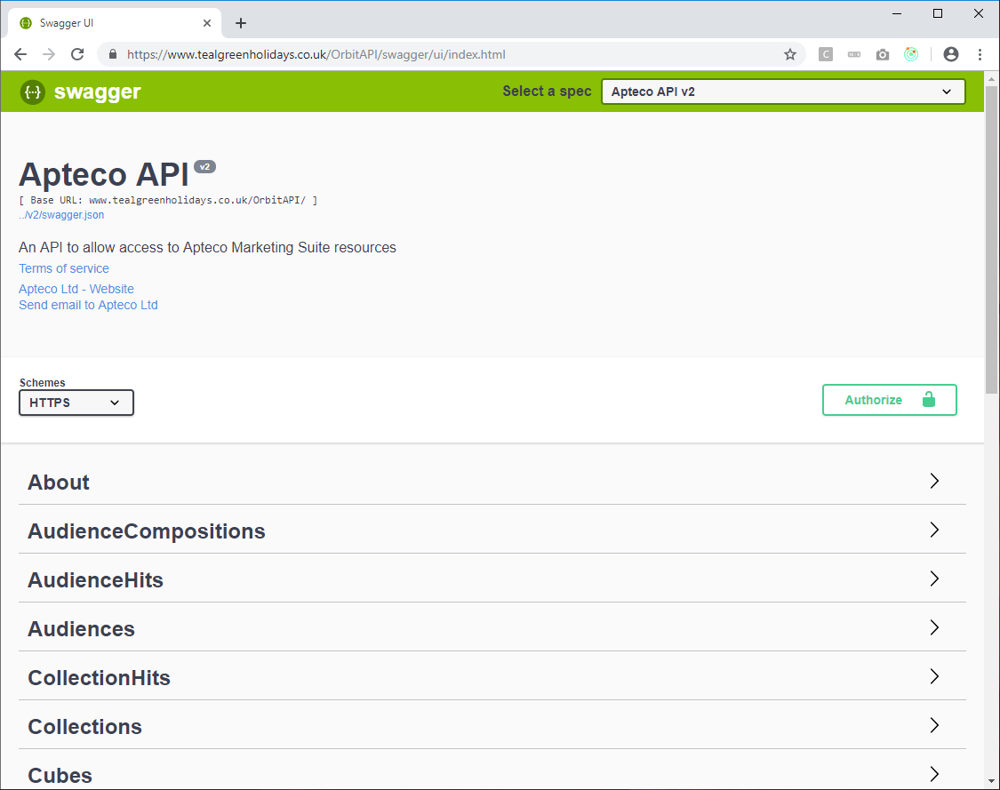
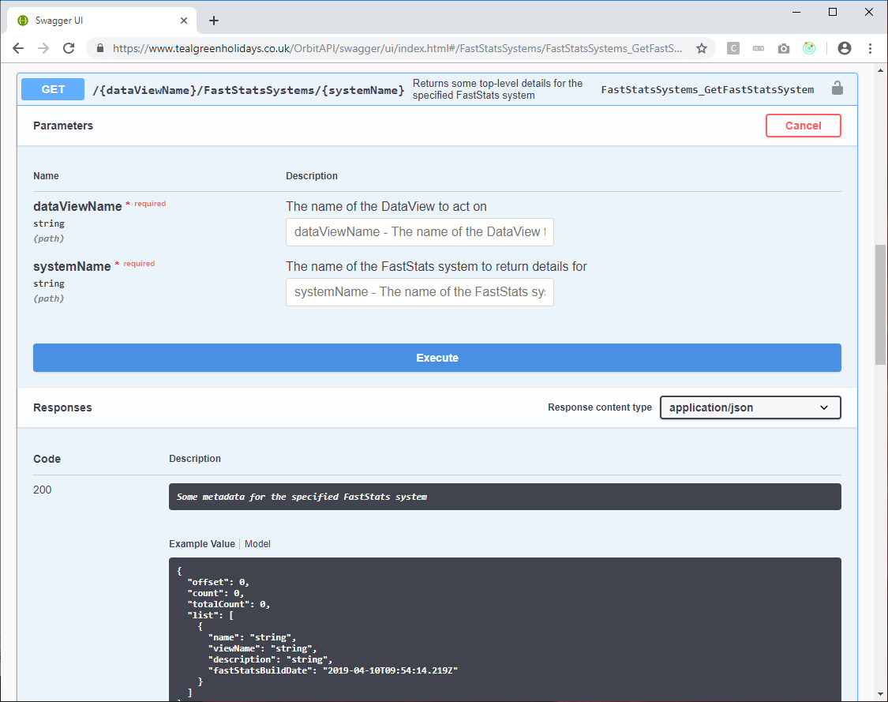
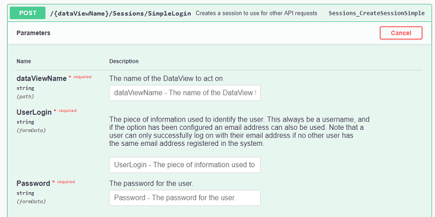
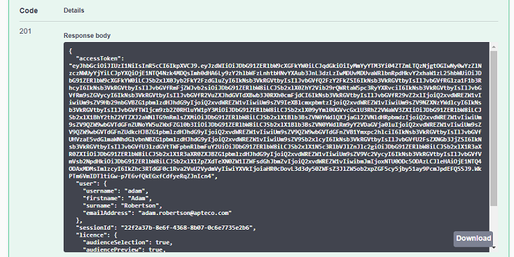
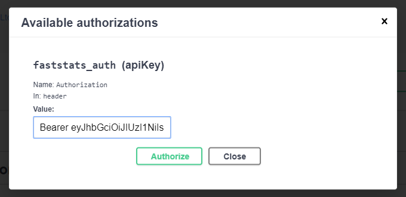

# Apteco API - Getting Started
The Apteco API is a RESTful API that provides access to functionality within the [Apteco Marketing Suite™](http://www.apteco.com).
It is designed to allow you to create applications and integrations with data available from within the Apteco Marketing Suite™.

This guide will help you through the process of developing such applications.

## Contents

* [Setting up and configuring the Apteco API](#setting-up-and-configuring-the-apteco-api)
  * [How Orbit uses the API](#how-orbit-uses-the-api)
* [A quick tour](#a-quick-tour)
  * [Swagger UI](#swagger-ui)
  * [DataViews](#dataViews)
  * [Authentication](#authentication)
* [Areas covered by the Apteco API](#areas-covered-by-the-apteco-api) 
* [Writing your first application](#writing-your-first-application)
  * [Connecting to the API](#connecting-to-the-api)
  * [Logging in](#logging-in)
  * [Loading a saved query definition](#loading-a-saved-query-definition)
  * [Modify a query](#modify-a-query)
  * [Count a query](#count-a-query)
  * [Putting it all together](#putting-it-all-together)

## Setting up and configuring the Apteco API
The Apteco API is available as part of the Apteco Marketing Suite™.  For details on installing the Apteco API, please contact
your Apteco partner or Apteco Support.

The Apteco API is typically installed as part of the Apteco Orbit™ platform and the Apteco Orbit™ browser-based UI depends on
the Apteco API to function.  If you already have Apteco Orbit™ installed then the Apteco API will be available.

### How Orbit uses the API
The Apteco Orbit™ browser-based UI uses lots of the API's functions and can be a good way of learning how to interact with
the API.  To understand how the Orbit UI uses the API see [How Orbit Uses The API](HowOrbitUsesTheAPI.md).

## A quick tour

### Swagger UI
Once you have the Apteco API installed you should be able to browse to the online documentation:



The URL of this page will depend on your installation, but if the API was installed at
https://www.example.com then the API would typically be available from https://www.example.com/OrbitAPI/swagger/ui

The API has been developed with the [Swagger/Open API Specification](https://swagger.io/resources/open-api/).
The Swagger UI shown above allows you to browse through the endpoints that are available in the API.

For each endpoint, you can then delve into the parameters and expected inputs and outputs.  The Swagger UI also 
allows you to enter values and try out the endpoint to see what it returns.  This is very useful when
developing applications against the API:



### DataViews

Lots of the API endpoints refer to DataViews, and in many cases a `dataViewName` parameter will be required.

A DataView is a configuration within the Apteco API and within Orbit.  A DataView name performs a similar role
to a FastStats system name, except that a single DataView can contain configuration for multiple FastStats
systems.

This is useful when an organisation has multiple FastStats systems, but users who are not deeply familiar with
the differences of each system can log in to just one view of the data.  For example, a DataView can contain Orbit
collections for different FastStats systems and list them side by side. 

### Authentication

Some endpoints in the Apteco API (such as the `/About/Version` endpoint) don't require authentication before they
can be accessed but most functionality is dependent on having valid user credentials.  The sample applications
([mentioned here](../Readme.md#sample-applications)) show how to programatically perform authentication.  However, to
access endpoints that require authentication using the Swagger UI go through the following steps:

1. Go to the `Sessions/SimpleLogin` endpoint:



2. Enter the Data View you want to log in to, the "UserLogin" (either the FastStats username or email address
of the user you want to log in as) and the user's password.  Press the "Execute" button to call the endpoint.

3. The result of the call will be something like the following, with the first part of the returned JSON
4. containing an accessToken.  This is the [JWT](https://jwt.io/) that is used to authenticate with the API.



4. Copy the contents of the accessToken into your clipboard and then go to the top of the Swagger UI page
and click on the "Authorize" button.  Enter the string "Bearer" then a space and then the accessToken.
Then press Authorize to log in.



5. You will now be able to access all of the endpoints that require an authenticated user.

Note that if you are using Apteco Orbit™ and have logged in via this user interface then the required
"Bearer &lt;accessToken&gt;" string can be found in the headers for an authenticated request via the
development tools available in the browser.

## Areas covered by the Apteco API

The current version of the Apteco API (as of April 2019, version 1.7.2) contains endpoints for
accessing the following areas of functionality:

* Session & User Handling: Logging in/out, creating new users, resetting passwords.

* Orbit Collections: Creating, listing and calculating results for cubes, data grids, charts and Venns.

* Orbit Audiences: Creating, listing and calculating results for Orbit Audiences as well as providing
“check” aggregations and the ability to export selected data.

* Orbit Sharing: Sharing collections and audiences to other users.

* Orbit PeopleStage Dashboards: Returning summary data for parts of an Apteco PeopleStage diagram.

*	Access to FastStats files: Reading and writing files to the Apteco FastStats public/private directories.

*	FastStats Queries: Counting saved queries or user-defined query definitions.  NOTE: This is currently
marked as Experimental.

*	FastStats Exports: Being able to export an user-defined set of fields for records from a user-defined
query.  NOTE: This is currently marked as Experimental.

*	FastStats Cubes: Being able to generate aggregations of a user-defined set of dimensions for records
from a user-defined query.  NOTE: This is currently marked as Experimental.

We will continue to add more areas to the API over time.

The areas marked as "Experimental" are still being finalised and whilst are available for use the
functionality may still be subject to some small changes.  Experimental endpoints within the API must
be explicitly enabled via the API's configuration tool.

## Writing your first application

### Connecting to the API
It is possible to create a simple application in most popular programming languages by calling the API
endpoint URLs directly using whatever HTTP libraries are available. However it is often convenient to
use a client library to hide some of the HTTP details (including having to explicitly pass authentication
headers with each call, etc.)

Because the API has been created with a Swagger/Open API specification a client library can be generated
from the specification using the [swagger-codegen](https://github.com/swagger-api/swagger-codegen) tool.
See the [Generating an API Client Library](GeneratingAPIClientLibrary.md) guide for more details.

### Logging in

Once you have generated a client library (or hand-crafted your own if you have a particular requirement)
then typically the first task is to log in to the API.  An example of how to do this in C# is shown below:

``` csharp
private async Task<SessionDetails> Login(string dataViewName, string userLogin, string password)
{
  var sessionsApi = new SessionsApi(CreateConfiguration(null));
  return await sessionsApi.SessionsCreateSessionSimpleAsync(dataViewName, userLogin, password);
}

private const string BaseUrl = "https://example.com/OrbitAPI";

private Configuration CreateConfiguration(SessionDetails sessionDetails)
{
  var defaultHeaders = new Dictionary<string, string>();
  if (sessionDetails != null)
  {
    defaultHeaders.Add("Authorization", "Bearer " + sessionDetails.AccessToken);
  }

  return new Configuration()
  {
    DefaultHeader = defaultHeaders,
    BasePath = BaseUrl
  };
}
```

The `Login()` method connects to the `Sessions/SimpleLogin` endpoint with the given DataView name, username and password.
It returns a SessionDetails object containing (amongst other things) the access token required to authenticate
future API requests.

The `CreateConfiguration()` method is used to provide configuration details to each call of the API.  If there are
`SessionDetails` provided, the Authorization header will be set appropriately.  In this example the URL of the API is hardcoded/.

### Loading a saved query definition

Once you are logged in you can call any of the endpoints.  Some endpoints will be unavailable to you depending on the licence
your user has or the roles set for your user.  Both of these things can be determined via the Users Explorer in Apteco FastStats®.

If the logged in user has the Analyzer bundle (which includes the "Advanced Query" licence ability) then they will be able to load
a saved query from a private or public directory from the FastStats® system.  The code required to do this would be:

``` csharp
private async Task<Query> GetQuery(string dataViewName, string systemName, string queryFilePath, SessionDetails sessionDetails)
{
  var queriesApi = new QueriesApi(CreateConfiguration(sessionDetails));
  QueryResult queryResult = await queriesApi.QueriesPerformGetQueryFileDefinitionSynchronouslyAsync(dataViewName, systemName, new QueryFile(queryFilePath));
  return queryResult?.Query;
}
```

Note here you will need the name of the DataView you logged in with, the name of the FastStats® system that the file is in and the
path to the file.  The file path is of the form `Public/Dir/Subdir/Query.xml` or `Private/Dir/Subdir/Query.xml`. You also
need the `SessionDetails` object that was obtained when you logged in.

This calls the `{dataViewName}/Queries/{systemName}/GetFileSync` endpoint.

### Modify a query

Once we have loaded a query we can count it straight away by passing it to the `{dataViewName}/Queries/{systemName}/CountSync`
endpoint.  Indeed, if we wanted to count it without modification then we could use the 
`{dataViewName}/Queries/{systemName}/CountFileSync` endpoint directly to pass in a file path and get a set of counts.

However a more interesting example would be to modify the query first.  In this example we search for a criteria that uses
a given variable and replaces the selected values with some new ones.

``` csharp
private void ModifyQuery(Query query, string variableName, string replacementValue)
{
  ModifyClause(query?.Selection?.Rule?.Clause, variableName, replacementValue);
}

private void ModifyClause(Clause clause, string variableName, string replacementValue)
{
  if (clause?.Criteria != null)
  {
    ModifyCriteria(clause.Criteria, variableName, replacementValue);
  }

  if (clause?.Logic?.Operands != null)
  {
    foreach (Clause childClause in clause.Logic.Operands)
      ModifyClause(childClause, variableName, replacementValue);
  }

  if (clause?.SubSelection?.Selection?.Rule?.Clause != null)
  {
    ModifyClause(clause.SubSelection.Selection.Rule.Clause, variableName, replacementValue);
  }
}

private void ModifyCriteria(Criteria criteria, string variableName, string replacementValue)
{
  if ((criteria?.VariableName == variableName) && 
      (criteria?.ValueRules?.Count > 0) &&
      (criteria.ValueRules[0]?.ListRule?.VariableName == variableName))
  {
    criteria.ValueRules[0].ListRule.List = replacementValue;
  }
}
```

The three methods above go through the query tree to find all the criteria nodes:

* The `ModifyQuery()` method finds the root clause in the query and passes it on to `ModifyClause()`.
* The `ModifyClause()` method handles the three types of clause.  If the clause has a criteria then
this is passed directly to the `ModifyCriteria()` method.  If the clause has a logic then each child
clause of the logic is recursed through.  If the logic has a sub-selection (used for applying limits,
RFVs, etc. to parts of the query) then the inner clause is recursed into.
* The `ModifyCriteria()` method handles the leaves of the query and applies the replacement value if
the criteria is for the appropriate variable name.

### Count a query

To count the modified query it can be passed back to the `{dataViewName}/Queries/{systemName}/CountSync` endpoiont.

``` csharp
private async Task<Count> CountQuery(string dataViewName, string systemName, Query query, SessionDetails sessionDetails)
{
  var queriesApi = new QueriesApi(CreateConfiguration(sessionDetails));
  var queryResult = await queriesApi.QueriesPerformQueryCountSynchronouslyAsync(dataViewName, systemName, query);
  return queryResult?.Counts?.FirstOrDefault();
}
```

This uses the dataViewName and systemName from before plus the query that was modified above and the sessionDetails.

### Putting it all together

Finally, to build a sample console application from its component parts we can put it all together:

``` csharp
private async Task OutputCount(string dataViewName, string systemName, string userLogin, string password, string queryFilePath)
{
  var sessionDetails = await Login(dataViewName, userLogin, password);
  var query = await GetQuery(dataViewName, systemName, queryFilePath, sessionDetails);
  if (query == null)
  {
    Console.WriteLine("No query returned");
    return;
  }

  //This looks for all variables with the name peTitle and selects categories with the codes 01 and 02.
  ModifyQuery(query, "peIncome", "01\t02");
  
  var count = await CountQuery(dataViewName, systemName, query, sessionDetails);
  if (count == null)
  {
    Console.WriteLine("No count returned for query");
    return;
  }

  Console.WriteLine($"The query returned {count.CountValue} {count.TableName}");
}
```

For further examples of using the Apteco API, see the [Sample Applications](../Readme.md#sample-applications) section of the overall Readme.