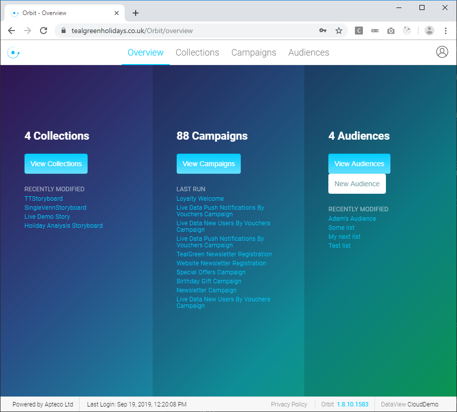
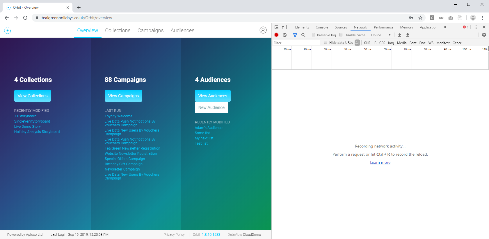
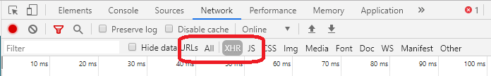
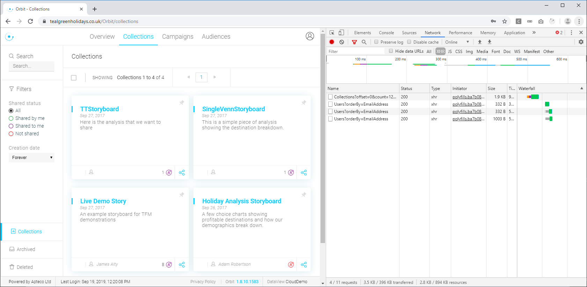
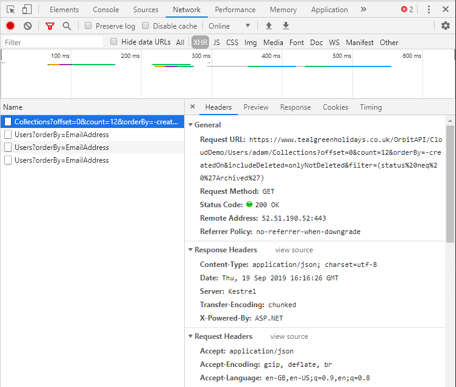
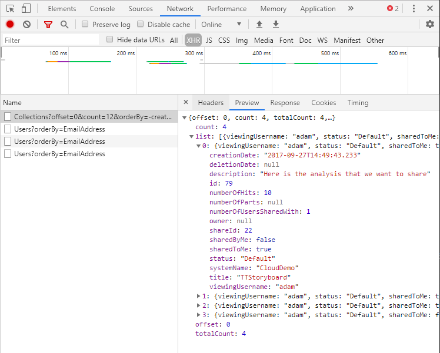
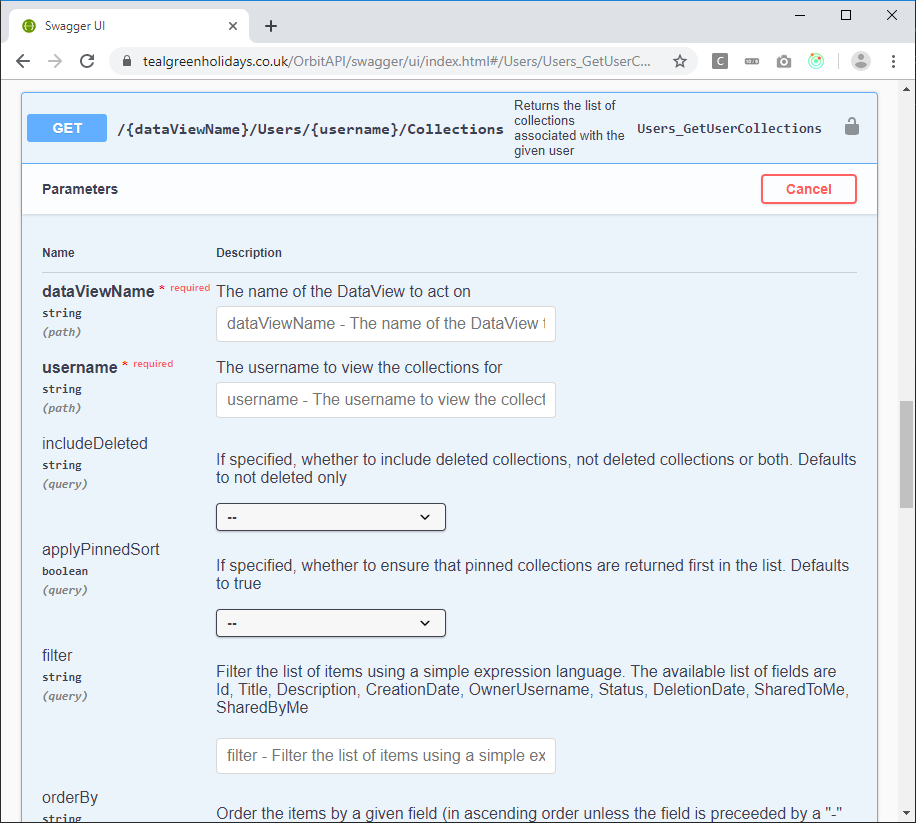
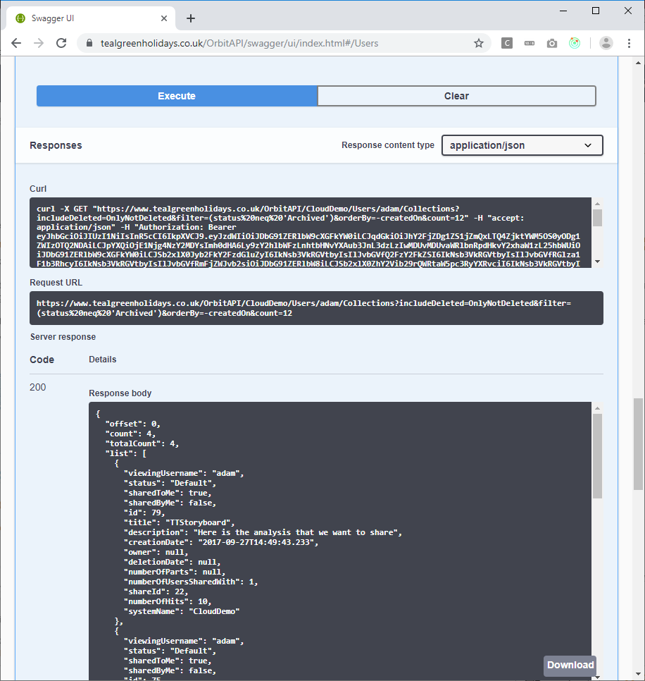

# Apteco API - How Orbit uses the API
The Apteco Orbit™ browser-based UI gets all of its data through the Apteco API and interacts with it a lot.  Therefore if you
are learning about how to use the API it is a good place to start.

This guide will help you understand how to watch what the Orbit UI does when it interacts with the Apteco API

## Contents

* [Using the Chrome development tools](#using-the-chrome-development-tools)
* [Investigating a request](#investigating-a-request)
* [Comparing this to the Swagger documentation](#comparing-this-to-the-swagger-documentation)

## Using the Chrome development tools
A good way of seeing how the UI retrieves the information it needs from the API is to use the browser’s development tools.  For example, you can use Chrome to find this information by following these steps:

Navigate to Orbit and log in using Chrome :

Bring up the Chrome developer tools (use the "Hamburger" menu at the top right of the Chrome user interface and then More tools -> Developer tools).  Then go to the Network tab.

Then change the filter selection from "All" to just "XHR" – to just show requests made by the browser to the API (and exclude requests for images or CSS, HTML, etc.)

 
Click on the page that you want to see the information for.  Let's look at the list of collections, so let's press the "View Collections" button.  The developer console will show all the requests made by the UI to the API:

In this case the first request shown is the one that gets the list of collections.  The other requests return information about the users that each of the collections have been shared to.  In this case 3 out of the 4 collections have been shared and so only 3 requests are made.

## Investigating a request
We can look at the first request to see what it looks like:

Here we can see that we are making a request to the URL:

`https://www.tealgreenholidays.co.uk/OrbitAPI/CloudDemo/Users/adam/Collections?offset=0&count=12&orderBy=-createdOn&includeDeleted=onlyNotDeleted&filter=(status%20neq%20%27Archived%27)`

The endpoint is `/OrbitAPI/CloudDemo/Users/adam/Collections` and the query string contains paging and filtering information:

*	In the above URL, `CloudDemo` is the DataView and `adam` is the username.
*	`offset=0&count=12` means that this is a page of 12 results, offset by 0 (i.e. the first page).  To get a second page of 12 results you would request `count=12&offset=12`.  The third page would be `count=12&offset=24` and so on.
*	`orderBy=-createdOn` means that the list will be sorted by the created date, with the sort order being descending (newest first).  To get an ascending order just omit the minus sign.
*	`includeDeleted=onlyNotDeleted` is a particular filter for listing collections so that only items that have not been deleted are returned.  If you view the deleted page of collections then the request to the API is changed in this regard.
*	`filter=(status%20neq%20%27Archived%27)` is an extra filter on the list to exclude archived items too.  If we URL decode this then the string becomes the more readable `filter=(status neq 'Archived')`.  If you searched for collections which contain only a particular word in their title then this filter string could be expanded to something like `filter=(status neq 'Archived') and (title like 'story')`

Note that this paging, sorting and filtering mechanism is standard across the API where a list of results are returned.

If you click on the "Preview" tab in the developer tools you can then see what the API returned:

Here we can see that the first collection in my list has an id of 79, a title of "TTStoryboard" and was created in September 2017.

If in the Orbit UI you then clicked on the collection to view it there would be further requests sent to the API for the details of the collection and the visualisations that it contains. 

## Comparing this to the Swagger documentation

Now we know what the Orbit UI does to return a list of collections we can find the "List of collections" endpoint in the swagger UI:

We can then use the Swagger UI to make requests without using the Orbit UI to see how things work.

As this request is marked with a "padlock" icon, you will first have to authenticate with the Swagger UI.  See [the authentication section in the Getting Started guide](GettingStarted.md#authentication).

Then you can hit the "Try it out" button and enter the details that we picked out from the bullet list URL above.  The Swagger UI tells us that we only need to specify `dataViewName` and `username`, but we can also add `offset`, `count`, `orderBy`, `includeDeleted` and `filter` if we want.

We can then press the "Execute" button and the API will return the same results as it did to the Orbit UI:

