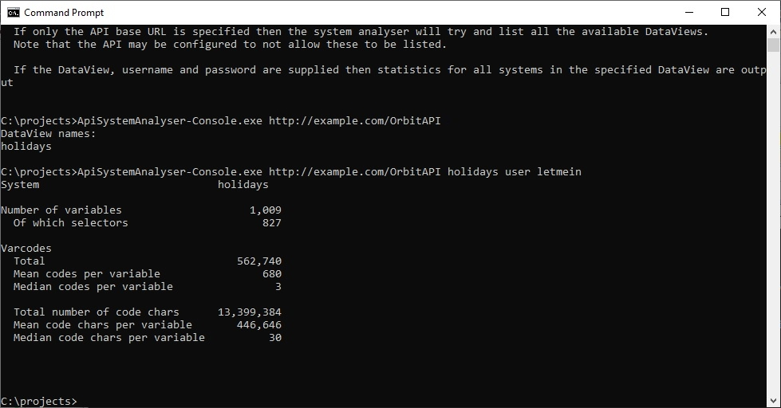
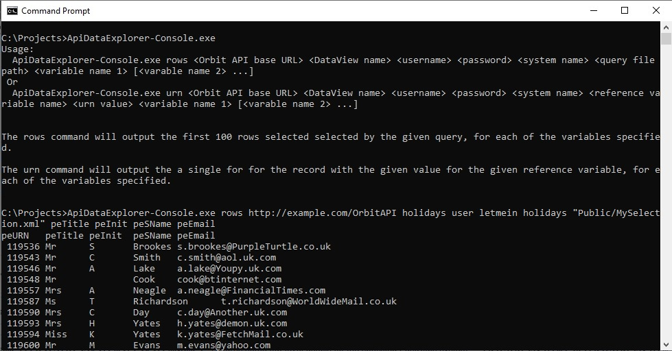
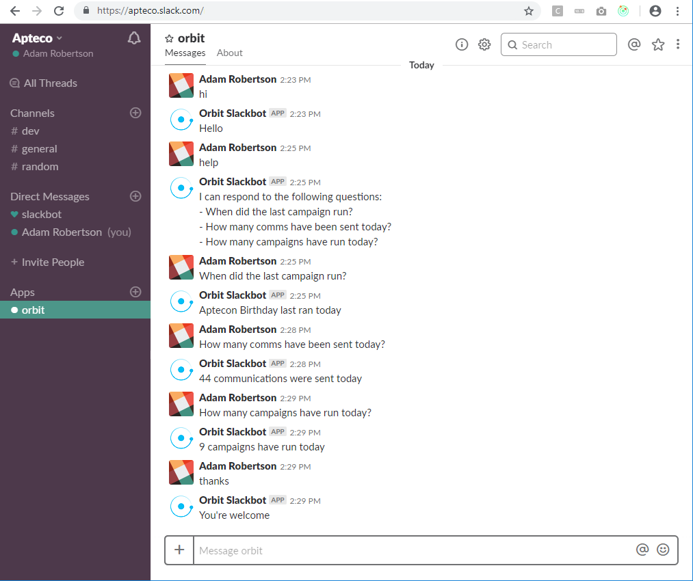

# Apteco API Guides
This repository provides some Getting Started documentation for the Apteco API and links to some sample applications.

## Contents

* [What is the Apteco API](#what-is-the-apteco-api)
  * [Documentation](#documentation)
  * [Sample Applications](#sample-applications)

## What is the Apteco API?
The Apteco API is a RESTful API that provides programmatic access to functionality within the [Apteco Marketing Suite™](http://www.apteco.com).

The Apteco Marketing Suite™ provides a unique combination of speed and power for turning Insight into Action.  This is achieved using our
Marketing Data Analysis and Multi-channel campaign automation tools.

The Apteco API provides programmatic access to information held in an [Apteco FastStats®](https://www.apteco.com/products/faststats) database, as
well as reporting information generated from [Apteco PeopleStage™](https://www.apteco.com/products/peoplestage),
the powerful multi channel campaign automation software.

If you have access to the Apteco Marketing Suite™ then you can install the Apteco API as part of [Apteco Orbit™](https://www.apteco.com/products/orbit).
Please contact your Apteco partner.

If you have not yet purchased the Apteco Marketing Suite™ then please [get in touch](https://www.apteco.com/contact-us) and we can direct you
to one of our partners. 

### Documentation
The currently available documentation is:
 
* [Getting Started Guide](Guides/GettingStarted.md): General information on how to start using the Apteco API.

* [Generating an API Client Library](Guides/GeneratingAPIClientLibrary.md): How to automatically generate a client library to connect to the Apteco API.

* [How Orbit uses the API](Guides/HowOrbitUsesTheAPI.md): Investigating how the Apteco Orbit™ UI uses the Apteco API.

### Sample Applications

* [ApiSystemAnalyser](https://github.com/Apteco/ApiSystemAnalyser): A sample console application that demonstrates how to log in and request
 some high level metadata about a FastStats® system.  This sample is written in C# using .Net Core.

* [ApiDataExplorer](https://github.com/Apteco/ApiDataExplorer): A sample console application that demonstrates how to log in and export some data
from a FastStats® system.  This sample is written in C# using .Net Core.

* [OrbitSlackBot](https://github.com/Apteco/OrbitSlackBot): A sample application that demonstrates how to integrate the Apteco API
 with the [Slack](https://slack.com/) collaboration and messaging platform.  This sample is written in C# using .Net Framework

